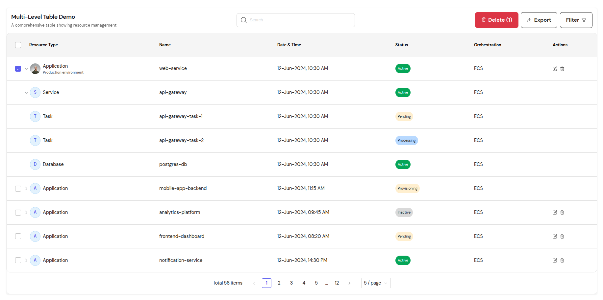

# React Multi Level Table

<div align="center">
<!-- Screenshot of the table component in action -->

</div>

## Table of Contents

- [Overview](#overview)
- [Installation](#1-installation)
  - [Prerequisites](#prerequisites)
- [Configuration](#2-configuration)
  - [Basic Usage](#21-basic-usage)
  - [Component Props](#22-component-props)
- [Customization](#3-customization)
  - [Column Configuration](#31-column-configuration)
  - [DataItem Interface](#32-dataitem-interface)
  - [FilterOption Interface](#33-filteroption-interface)
  - [Expand Icon Customization](#34-expand-icon-customization)
  - [Selection Props](#35-selection-props)
  - [Sort Icons](#36-sort-icons)
  - [Search and Filter Features](#37-search-and-filter-features)
  - [Export Functionality](#38-export-functionality)
  - [Delete Functionality](#39-delete-functionality)
  - [Dropdown Management](#310-dropdown-management)
  - [Row Actions](#311-row-actions)
  - [Row Expansion](#312-row-expansion)
  - [Pagination](#313-pagination)
  - [Theme Customization](#314-theme-customization)
- [Development](#4-development)
  - [Project Structure](#41-project-structure)
  - [Development Commands](#42-development-commands)
  - [Development Features](#43-development-features)
- [Example](#5-example)
- [License](#license)

## Overview

The `@keyvaluesystems/multilevel-table` is a flexible and customizable multi-level table component for React applications. It provides comprehensive support for displaying hierarchical data with features like sorting, filtering, and pagination. This documentation provides detailed information on how to install, configure, and use the component effectively.

## 1. Installation

You can install the component from npm:

```bash
npm install @keyvaluesystems/multilevel-table
```

or from yarn:

```bash
yarn add @keyvaluesystems/multilevel-table
```

#### Prerequisites

- React v16.8+
- TypeScript (recommended)

## 2. Configuration

### 2.1 Basic Usage

Here's a basic example of how to use the MultiLevelTable component:

```tsx
import { MultiLevelTable } from '@keyvaluesystems/multilevel-table';

const data = [
  {
    id: 1,
    name: 'Parent 1',
    value: 100,
    status: 'active',
    children: [
      {
        id: 2,
        name: 'Child 1',
        value: 50,
        status: 'pending',
      },
      {
        id: 3,
        name: 'Child 2',
        value: 50,
        status: 'completed',
      },
    ],
  },
];

const columns = [
  {
    key: 'name',
    title: 'Name',
    filterable: true,
      sortable: true,
      width: '25%',
  },
  {
    key: 'value',
    title: 'Value',
    filterable: true,
      sortable: true,
      width: '20%',
    render: (value) => `$${value}`,
  },
  {
    key: 'status',
    title: 'Status',
    filterable: true,
      sortable: true,
      width: '15%',
    render: (value) => (
      <span style={{ 
        padding: '4px 8px',
        borderRadius: '4px',
        backgroundColor: value === 'active' ? '#e6ffe6' : 
                        value === 'pending' ? '#fff3e6' : '#e6f3ff',
        color: value === 'active' ? '#006600' :
               value === 'pending' ? '#cc7700' : '#0066cc'
      }}>
        {value}
      </span>
    ),
  },
];

function App() {
  return (
    <MultiLevelTable 
      data={data} 
      columns={columns}
      pageSize={10}
    />
  );
}
```

### 2.2 Component Props

The MultiLevelTable component accepts the following props:

#### Data and Configuration Props
| Prop | Type | Required | Default | Description |
|------|------|----------|---------|-------------|
| data | DataItem[] | Yes | - | Array of data objects to display in the table |
| columns | Column[] | Yes | - | Array of column configurations |
| pageSize | number | No | 10 | Number of rows to display per page |
| theme | ThemeProps | No | - | Custom theme object for styling the table |
| renderCustomPagination | function | No | null | Custom pagination component render function |
| sortable | boolean | No | false | Enable/disable sorting functionality |
| ascendingIcon | ReactNode | No | - | Custom icon for ascending sort |
| descendingIcon | ReactNode | No | - | Custom icon for descending sort |
| expandIcon | ReactNode | No | - | Custom icon for expanding rows |
| selectable | boolean | No | false | Enable/disable row selection |

#### State Props
| Prop | Type | Required | Default | Description |
|------|------|----------|---------|-------------|
| selectionState | SelectionState | No | { selectedRows: new Set(), isAllSelected: false } | Current selection state with selected rows and all selected flag |
| searchTerm | string | No | '' | Current search term for filtering data |
| selectedFilterValues | Set<string \| number> | No | new Set() | Currently selected filter values |
| deletePopup | object | No | { isOpen: false, itemId: null, itemName: '' } | Delete confirmation popup state (isOpen, itemId, itemName) |
| bulkDeletePopup | object | No | { isOpen: false, selectedCount: 0 } | Bulk delete confirmation popup state (isOpen, selectedCount) |
| openDropdowns | Set<string> | No | new Set() | Set of currently open dropdown IDs |
| expandedRows | Set<string \| number> | No | new Set() | Set of currently expanded row IDs |

#### Handler Props
| Prop | Type | Required | Default | Description |
|------|------|----------|---------|-------------|
| onSearchChange | (searchTerm: string) => void | No | - | Updates the search term for filtering data |
| onFilterChange | (values: Set<string \| number>) => void | No | - | Updates the selected filter values |
| onDeleteClick | (itemId: string \| number, itemName: string) => void | No | - | Handles delete button click for a specific row |
| onDeleteConfirm | () => void | No | - | Confirms the delete action for the selected row |
| onDeleteCancel | () => void | No | - | Cancels the delete action and closes popup |
| onBulkDeleteClick | () => void | No | - | Handles bulk delete button click for selected rows |
| onBulkDeleteConfirm | () => void | No | - | Confirms the bulk delete action for selected rows |
| onBulkDeleteCancel | () => void | No | - | Cancels the bulk delete action and closes popup |
| onDropdownToggle | (buttonId: string, isOpen: boolean) => void | No | - | Toggles dropdown open/close state for action buttons |
| onDropdownClose | (buttonId: string) => void | No | - | Closes a specific dropdown by ID |
| onButtonClick | (button: ButtonConfig) => void | No | - | Handles click events for action buttons (export, filter, etc.) |
| onSelectAll | () => void | No | - | Handles select all checkbox click to select/deselect all rows |
| onRowSelect | (rowId: string \| number) => void | No | - | Handles individual row selection checkbox click |
| onRowToggle | (rowId: string \| number) => void | No | - | Handles row expand/collapse toggle for nested rows |

#### Additional Props
| Prop | Type | Default | Description |
|------|------|---------|-------------|
| onRowClick | (row: DataItem) => void | - | Callback function when a parent row is clicked |
| searchableColumns | string[] | - | Array of column keys to search in |
| showSearchBar | boolean | true | Whether to show the search bar |
| filterColumn | string | - | The column to filter by |
| tableTitle | string | - | Title displayed above the table |
| tableSubtitle | string | - | Subtitle displayed below the table title |
| showDarkMode | boolean | false | Whether to show dark mode toggle button |
| isDarkMode | boolean | false | Current dark mode state |
| onToggleTheme | () => void | - | Callback function to toggle between light/dark themes |

## 3. Customization

### 3.1 Column Configuration

Each column object should have the following properties:

| Property | Type | Required | Description |
|----------|------|----------|-------------|
| key | string | Yes | Key to access the data in each row |
| title | string \| ReactNode | Yes | Column header text or custom component |
| render | function | No | Custom render function for the column. Receives (value: string \| number, item: DataItem) as parameters |
| filterable | boolean | No | Whether the column can be filtered |
| sortable | boolean | No | Whether the column can be sorted |
| customSortFn | function | No | Custom sorting function. Receives (rowA: DataItem, rowB: DataItem, columnId: string) as parameters |
| filterOptions | FilterOption[] | No | Array of filter options for the column |

### 3.2 DataItem Interface

The data items should conform to the following interface:

```tsx
interface DataItem {
  id: number;
  resourceType: string;
  name: string;
  dateTime: string;
  status: 'Active' | 'Inactive' | 'Pending' | 'Processing' | 'Provisioning';
  orchestration: string;
  imageURL?: string;
  subtext?: string;
  showActionButtons?: boolean;
  children?: DataItem[];
}
```

### 3.3 FilterOption Interface

Filter options for columns should conform to:

```tsx
interface FilterOption {
  label: string;
  value: string | number;
}
```

### 3.4 Expand Icon Customization

You can customize the expand icon for rows with children using the `expandIcon` prop:

```tsx
<MultiLevelTable
  data={data}
  columns={columns}
  expandIcon={<CustomExpandIcon />} // Your custom expand icon component
/>
```

The expand icon will be displayed for rows that have children. You can provide any React component as the icon.

### 3.5 Selection Props

The table supports row selection with the following props:

```tsx
<MultiLevelTable
  data={data}
  columns={columns}
  selectable={true} // Enable row selection
  selectionState={{
    selectedRows: new Set(),
    isAllSelected: false
  }}
  onSelectAll={() => {
    // Handle select all
  }}
  onRowSelect={(rowId) => {
    // Handle individual row selection
  }}
/>
```

| Prop | Type | Description |
|------|------|-------------|
| selectable | boolean | Enable/disable row selection functionality |
| selectionState | SelectionState | Current selection state with selected rows and all selected flag |
| onSelectAll | function | Callback function for select all checkbox |
| onRowSelect | function | Callback function for individual row selection |

**Note**: Child rows (nested rows) do not display checkboxes. They automatically show placeholder spacers to maintain alignment with parent rows.

### 3.6 Sort Icons

You can customize the sort icons for ascending and descending states:

```tsx
<MultiLevelTable
  data={data}
  columns={columns}
  sortable={true}
  ascendingIcon={<CustomAscendingIcon />} // Custom icon for ascending sort
  descendingIcon={<CustomDescendingIcon />} // Custom icon for descending sort
/>
```

| Prop | Type | Description |
|------|------|-------------|
| ascendingIcon | ReactNode | Custom icon component for ascending sort state |
| descendingIcon | ReactNode | Custom icon component for descending sort state |

### 3.7 Search and Filter Features

The table provides comprehensive search and filtering capabilities:

#### Global Search
- **Searchable**: Parent level search
- **Search Input**: Real-time search with debounced input
- **Search Icon**: Customizable search icon with proper positioning
- **Placeholder Text**: Customizable placeholder text for search input
- **Searchable Columns**: Specify which columns to include in search via `searchableColumns` prop

#### Column Filtering
- **Filterable Columns**: Individual columns can be marked as filterable
- **Filter Dropdowns**: Dropdown-based filtering with multiple selection
- **Filter Options**: Custom filter options for each column
- **Filter State**: Maintains filter state across pagination
- **Filter Column**: Specify which column to filter via `filterColumn` prop

**Important Note**: Search and filter features are currently implemented at the parent level only. Child rows (nested rows) are not included in search results or filter operations. This ensures consistent behavior and performance.

#### Filter Configuration
```tsx
const columns = [
  {
    key: 'status',
    title: 'Status',
    filterable: true,
    filterOptions: [
      { label: 'Active', value: 'active' },
      { label: 'Pending', value: 'pending' },
      { label: 'Completed', value: 'completed' }
    ]
  }
];
```

### 3.8 Export Functionality

The table supports data export through the action buttons. Export functionality is handled through the `onButtonClick` prop when export buttons are clicked.

### 3.9 Delete Functionality

The table supports both individual and bulk delete operations:

#### Individual Delete
- **Delete Buttons**: Action buttons in each row for individual deletion
- **Delete Confirmation**: Popup confirmation for delete actions
- **Delete State**: `deletePopup` state manages confirmation popup

#### Bulk Delete
- **Bulk Selection**: Select multiple rows for bulk operations
- **Bulk Delete Button**: Action button for bulk deletion
- **Bulk Delete Confirmation**: Popup confirmation for bulk delete actions
- **Bulk Delete State**: `bulkDeletePopup` state manages bulk confirmation popup

```tsx
<MultiLevelTable
  data={data}
  columns={columns}
  deletePopup={{
    isOpen: false,
    itemId: null,
    itemName: ''
  }}
  bulkDeletePopup={{
    isOpen: false,
    selectedCount: 0
  }}
  onDeleteClick={(itemId, itemName) => {
    // Handle individual delete click
  }}
  onDeleteConfirm={() => {
    // Handle delete confirmation
  }}
  onDeleteCancel={() => {
    // Handle delete cancellation
  }}
  onBulkDeleteClick={() => {
    // Handle bulk delete click
  }}
  onBulkDeleteConfirm={() => {
    // Handle bulk delete confirmation
  }}
  onBulkDeleteCancel={() => {
    // Handle bulk delete cancellation
  }}
/>
```

### 3.10 Dropdown Management

The table provides comprehensive dropdown state management:

```tsx
<MultiLevelTable
  data={data}
  columns={columns}
  openDropdowns={new Set()}
  onDropdownToggle={(buttonId, isOpen) => {
    // Handle dropdown toggle
  }}
  onDropdownClose={(buttonId) => {
    // Handle dropdown close
  }}
  onButtonClick={(button) => {
    // Handle button clicks
  }}
/>
```

### 3.11 Row Actions

The table supports row-level actions through customizable action icons and buttons:

| Prop | Type | Description |
|------|------|-------------|
| onRowClick | function | Callback when parent row is clicked |

**Action Icons and Functionality:**
- **showActionButtons**: DataItem property to control action button visibility per row
- **Customizable Actions**: You can add action icons like edit, delete, view, etc. through the `render` function in columns
- **Action Handlers**: Handle action clicks through the `onButtonClick` prop or custom render functions
- **Flexible Implementation**: Actions can be implemented as icons, buttons, or custom components within cell content

```tsx
<MultiLevelTable
  data={data}
  columns={columns}
  onRowClick={(row) => {
    console.log('Row clicked:', row);
  }}
  onButtonClick={(button) => {
    console.log('Action button clicked:', button);
  }}
/>
```

### 3.12 Row Expansion

The table supports expandable rows with nested data:

```tsx
<MultiLevelTable
  data={data}
  columns={columns}
  expandedRows={new Set()}
  onRowToggle={(rowId) => {
    // Handle row expansion/collapse
  }}
/>
```

### 3.13 Pagination

The table component provides comprehensive pagination functionality. You can either use the default pagination or create a custom one using the pagination props:

```tsx
interface PaginationProps {
  page: Row<T>[];                    // Current page data
  canPreviousPage: boolean;          // Whether previous page is available
  canNextPage: boolean;              // Whether next page is available
  pageOptions: number[];             // Available page numbers
  pageCount: number;                 // Total number of pages
  gotoPage: (updater: number | ((pageIndex: number) => number)) => void;  // Go to specific page
  nextPage: () => void;              // Go to next page
  previousPage: () => void;          // Go to previous page
  setPageSize: (pageSize: number) => void;  // Change page size
  state: TableStateWithPagination<T>;  // Current table state
  theme?: ThemeProps;                // Optional theme for styling
}
```

Example of custom pagination:

```tsx
const CustomPagination = ({ 
  canPreviousPage,
  canNextPage,
  pageOptions,
  pageCount,
  gotoPage,
  nextPage,
  previousPage,
  setPageSize,
  state: { pageIndex, pageSize }
}) => {
  return (
    <div className="pagination">
      <button onClick={() => previousPage()} disabled={!canPreviousPage}>
        Previous
      </button>
      <span>
        Page{' '}
        <strong>
          {pageIndex + 1} of {pageOptions.length}
        </strong>
      </span>
      <button onClick={() => nextPage()} disabled={!canNextPage}>
        Next
      </button>
      <select
        value={pageSize}
        onChange={e => setPageSize(Number(e.target.value))}
      >
        {[10, 20, 30, 40, 50].map(size => (
          <option key={size} value={size}>
            Show {size}
          </option>
        ))}
      </select>
    </div>
  );
};

// Usage in MultiLevelTable
<MultiLevelTable
  data={data}
  columns={columns}
  renderCustomPagination={CustomPagination}
/>
```

### 3.14 Theme Customization

The table component supports comprehensive theme customization through the `theme` prop. Here's the complete theme interface:

```tsx
interface ThemeProps {
  colors?: {
    background?: string;
    primaryColor?: string;
    textColor?: string;
    borderColor?: string;
  };
  table?: {
    header?: {
      background?: string;
      textColor?: string;
      borderColor?: string;
    };
    cell?: {
      textColor?: string;
      borderColor?: string;
      nestedPadding?: string;
    };
    row?: {
      levelColors?: {background: string}[];
    };
    filter?: {
      background?: string;
      textColor?: string;
      borderColor?: string;
      focusBorderColor?: string;
      placeholderColor?: string;
    };
  };
  pagination?: {
    button?: {
      background?: string;
      textColor?: string;
      disabledOpacity?: string;
    };
    select?: {
      background?: string;
      textColor?: string;
      borderColor?: string;
    };
    info?: {
      textColor?: string;
    };
  };
  expandIcon?: {
    color?: string;
  };
}
```

Example usage:

```tsx
const theme = {
  colors: {
    background: '#ffffff',
    primaryColor: '#1976d2',
    textColor: '#333333',
    borderColor: '#e0e0e0'
  },
  table: {
    header: {
      background: '#f5f5f5',
      textColor: '#333333',
      borderColor: '#e0e0e0'
    },
    cell: {
      textColor: '#333333',
      borderColor: '#e0e0e0',
      nestedPadding: '24px'
    },
    row: {
      levelColors: [
        { background: '#ffffff' },
        { background: '#f8f8f8' },
        { background: '#f5f5f5' }
      ]
    },
    filter: {
      background: '#ffffff',
      textColor: '#333333',
      borderColor: '#e0e0e0',
      focusBorderColor: '#1976d2',
      placeholderColor: '#757575'
    }
  },
  pagination: {
    button: {
      background: '#1976d2',
      textColor: '#ffffff',
      disabledOpacity: '0.5'
    },
    select: {
      background: '#ffffff',
      textColor: '#333333',
      borderColor: '#e0e0e0'
    },
    info: {
      textColor: '#333333'
    }
  },
  expandIcon: {
    color: '#757575'
  }
};

// Usage in MultiLevelTable
<MultiLevelTable
  data={data}
  columns={columns}
  theme={theme}
/>
```

The theme customization allows you to:
- **Global Colors**: Customize background, primary, text, and border colors
- **Table Components**: Style headers, cells, and rows with custom colors and borders
- **Nested Levels**: Configure different background colors for each nesting level
- **Filter Components**: Customize filter dropdowns, inputs, and focus states
- **Pagination**: Style pagination buttons, selects, and info text
- **Icons**: Customize expand, sort, and action icon colors
- **Responsive Design**: All theme properties support responsive breakpoints
- **CSS Variables**: Theme properties can use CSS custom properties for dynamic theming

## 4. Component Features and Customization

### 4.1 MultiLevelTable Component
- **Hierarchical Data**: Supports unlimited nesting levels with automatic indentation
- **Responsive Design**: Percentage-based column widths with fixed table layout
- **Performance Optimized**: Virtual scrolling support for large datasets
- **Accessibility**: ARIA labels, keyboard navigation, and screen reader support
- **Customizable Icons**: Replace default expand, sort, and action icons
- **Event Handling**: Comprehensive callback system for all user interactions

### 4.2 TableRow Component
- **Level-based Styling**: Different background colors for each nesting level
- **Expand/Collapse**: Smooth animations for row expansion and collapse
- **Selection State**: Visual feedback for selected rows
- **Click Handlers**: Support for row click and action button clicks
- **Custom Rendering**: Flexible cell content rendering with custom components

### 4.3 TableCell Component
- **Flexible Content**: Support for text, numbers, custom components, and HTML
- **Alignment Options**: Left, center, and right text alignment
- **Custom Styling**: Inline styles and CSS classes for individual cells
- **Icon Integration**: Built-in support for expand, sort, and action icons
- **Responsive Behavior**: Automatic text truncation and ellipsis

### 4.4 TableHeader Component
- **Sortable Columns**: Click-to-sort functionality with custom sort icons
- **Filter Integration**: Dropdown filters with multi-select capability
- **Custom Styling**: Theme-based header styling with hover effects
- **Accessibility**: Proper ARIA labels and keyboard navigation
- **Responsive Design**: Adaptive header layout for mobile devices

### 4.5 Pagination Component
- **Page Navigation**: Previous/next buttons with page number display
- **Page Size Selection**: Dropdown to change items per page
- **Custom Rendering**: Complete pagination component replacement
- **State Management**: Automatic page state handling
- **Responsive Layout**: Mobile-friendly pagination controls

### 4.6 Filter Components
- **Dropdown Filters**: Multi-select dropdown with search capability
- **Global Search**: Real-time search across all columns
- **Filter State**: Persistent filter state across pagination
- **Custom Options**: Configurable filter options per column
- **Outside Click**: Automatic dropdown closure on outside clicks

### 4.7 Export Components
- **Multiple Formats**: CSV, Excel, and JSON export support
- **Custom Handlers**: Flexible export function customization
- **Data Filtering**: Export only visible or selected data
- **Progress Feedback**: Export progress indicators
- **Error Handling**: Comprehensive error handling for export operations

## 5. Development

### 4.1 Project Structure
- `src/App.tsx` - A demo component that showcases the MultiLevelTable with sample data
- `src/main.tsx` - The entry point for the development environment
- `src/index.css` - Basic styling for the table component
- `src/components/` - All table components (MultiLevelTable, TableRow, TableCell, etc.)
- `src/styles/` - CSS files for styling individual components
- `src/types/` - TypeScript type definitions
- `src/constants/` - Theme and configuration constants
- `example/` - Complete example application with all features

### 4.2 Development Commands
```bash
# Start the development server
npm run dev

# Build the package
npm run build

# Run linting
npm run lint
```

### 4.3 Development Features
- **Hot Module Replacement (HMR)**: Instant feedback during development
- **TypeScript Support**: Full type checking and IntelliSense support
- **ESLint Configuration**: Code quality and consistency enforcement
- **Sample Data**: Comprehensive test data with nested structures
- **Component Testing**: Unit tests for all major components
- **Responsive Design**: Mobile-first responsive design patterns
- **Accessibility**: ARIA labels and keyboard navigation support
- **Performance**: Optimized rendering with React.memo and useMemo

## 6. Example

Here's a complete example showing how to use the component with all features enabled:

```tsx
import React, { useState } from 'react';
import { MultiLevelTable } from '@keyvaluesystems/multilevel-table';

function App() {
  // State management
  const [selectedRows, setSelectedRows] = useState(new Set());
  const [searchTerm, setSearchTerm] = useState('');
  const [selectedFilterValues, setSelectedFilterValues] = useState(new Set());
  const [deletePopup, setDeletePopup] = useState({ isOpen: false, itemId: null, itemName: '' });
  const [bulkDeletePopup, setBulkDeletePopup] = useState({ isOpen: false, selectedCount: 0 });
  const [openDropdowns, setOpenDropdowns] = useState(new Set());
  const [expandedRows, setExpandedRows] = useState(new Set());

  const data = [
    {
      id: 1,
      resourceType: 'Application',
      name: 'web-service',
      dateTime: '12-Jun-2024, 10:30 AM',
      status: 'Active',
      orchestration: 'ECS',
      showActionButtons: true,
      children: [
        {
          id: 101,
          resourceType: 'Service',
          name: 'api-gateway',
          dateTime: '12-Jun-2024, 10:30 AM',
          status: 'Active',
          orchestration: 'ECS',
        },
      ],
    },
  ];

  const columns = [
    { key: 'resourceType', title: 'Resource Type', filterable: true },
    { key: 'name', title: 'Name', filterable: true },
    { key: 'dateTime', title: 'Date & Time', filterable: true },
    {
      key: 'status',
      title: 'Status',
      filterable: true,
      render: (value) => (
        <span style={{ 
          padding: '4px 8px',
          borderRadius: '4px',
          backgroundColor: value === 'Active' ? '#e6ffe6' : '#fff3e6',
          color: value === 'Active' ? '#006600' : '#cc7700'
        }}>
          {value}
        </span>
      ),
    },
    { key: 'orchestration', title: 'Orchestration', filterable: true },
  ];

  const theme = {
    colors: {
      background: '#ffffff',
      primaryColor: '#1976d2',
      textColor: '#333333',
      borderColor: '#e0e0e0'
    },
    table: {
      header: {
        background: '#f5f5f5',
        textColor: '#333333',
        borderColor: '#e0e0e0'
      },
      cell: {
        textColor: '#333333',
        borderColor: '#e0e0e0'
      },
      row: {
        levelColors: [
          { background: '#ffffff' },
          { background: '#f8f8f8' },
          { background: '#f5f5f5' }
        ]
      }
    }
  };

  return (
    <MultiLevelTable 
      data={data} 
      columns={columns}
      pageSize={10}
      theme={theme}
      sortable={true}
      selectable={true}
      
      // State props
      selectionState={{
        selectedRows,
        isAllSelected: selectedRows.size === data.length && data.length > 0
      }}
      searchTerm={searchTerm}
      selectedFilterValues={selectedFilterValues}
      deletePopup={deletePopup}
      bulkDeletePopup={bulkDeletePopup}
      openDropdowns={openDropdowns}
      expandedRows={expandedRows}
      
      // Handler props
      onSearchChange={setSearchTerm}
      onFilterChange={setSelectedFilterValues}
      onDeleteClick={(itemId, itemName) => {
        setDeletePopup({ isOpen: true, itemId, itemName });
      }}
      onDeleteConfirm={() => {
        console.log('Delete confirmed');
        setDeletePopup({ isOpen: false, itemId: null, itemName: '' });
      }}
      onDeleteCancel={() => {
        setDeletePopup({ isOpen: false, itemId: null, itemName: '' });
      }}
      onBulkDeleteClick={() => {
        setBulkDeletePopup({ isOpen: true, selectedCount: selectedRows.size });
      }}
      onBulkDeleteConfirm={() => {
        console.log('Bulk delete confirmed');
        setSelectedRows(new Set());
        setBulkDeletePopup({ isOpen: false, selectedCount: 0 });
      }}
      onBulkDeleteCancel={() => {
        setBulkDeletePopup({ isOpen: false, selectedCount: 0 });
      }}
      onDropdownToggle={(buttonId, isOpen) => {
        const newSet = new Set(openDropdowns);
        if (isOpen) {
          newSet.add(buttonId);
        } else {
          newSet.delete(buttonId);
        }
        setOpenDropdowns(newSet);
      }}
      onDropdownClose={(buttonId) => {
        const newSet = new Set(openDropdowns);
        newSet.delete(buttonId);
        setOpenDropdowns(newSet);
      }}
      onButtonClick={(button) => {
        console.log('Button clicked:', button);
      }}
      onSelectAll={() => {
        const newIsAllSelected = selectedRows.size !== data.length;
        const newSelectedRows = new Set();
        if (newIsAllSelected) {
          data.forEach(item => newSelectedRows.add(item.id));
        }
        setSelectedRows(newSelectedRows);
      }}
      onRowSelect={(rowId) => {
        const newSet = new Set(selectedRows);
        if (newSet.has(rowId)) {
          newSet.delete(rowId);
        } else {
          newSet.add(rowId);
        }
        setSelectedRows(newSet);
      }}
      onRowToggle={(rowId) => {
        const newSet = new Set(expandedRows);
        if (newSet.has(rowId)) {
          newSet.delete(rowId);
        } else {
          newSet.add(rowId);
        }
        setExpandedRows(newSet);
      }}
      
      // Other props
      onRowClick={(row) => console.log('Row clicked:', row)}
      searchableColumns={['resourceType', 'name', 'dateTime', 'orchestration']}
      filterColumn="status"
      tableTitle="Multi-Level Table Demo"
      tableSubtitle="A comprehensive table showing resource management"
      showDarkMode={false}
      isDarkMode={false}
      onToggleTheme={() => console.log('Theme toggled')}
    />
  );
}

export default App;
```

## License

MIT
